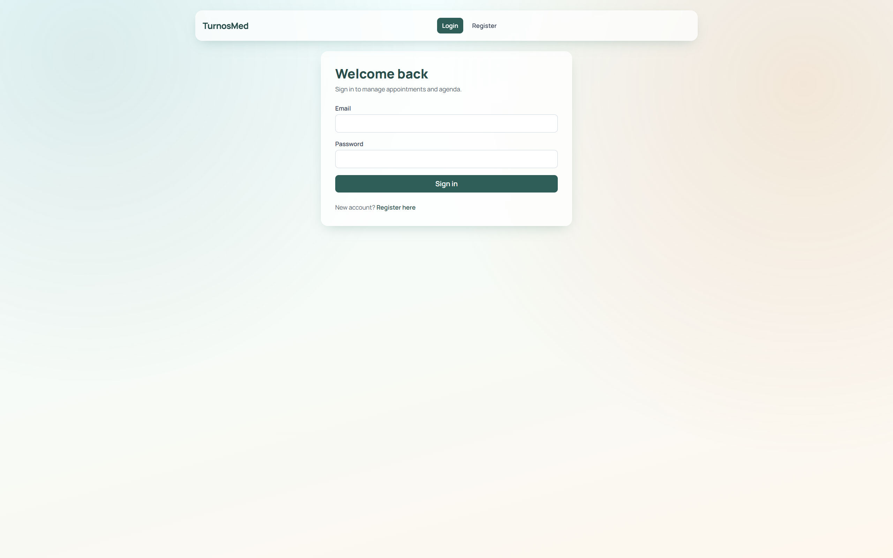
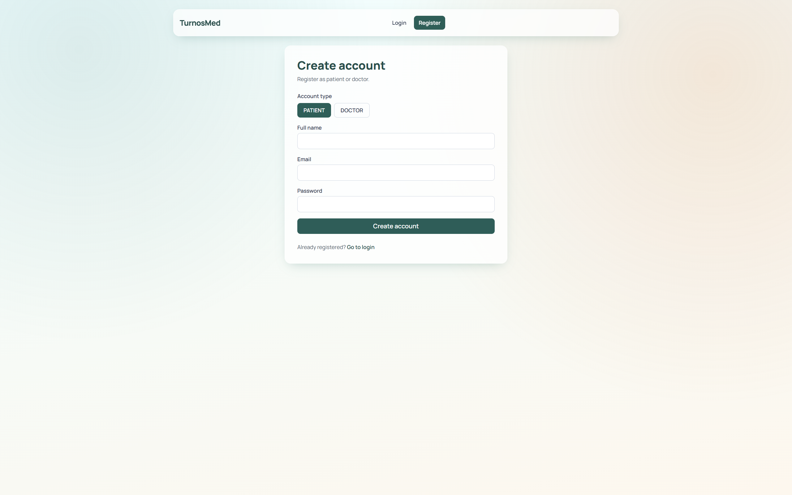
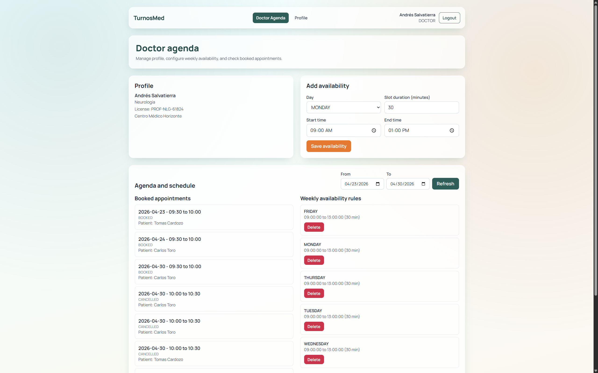
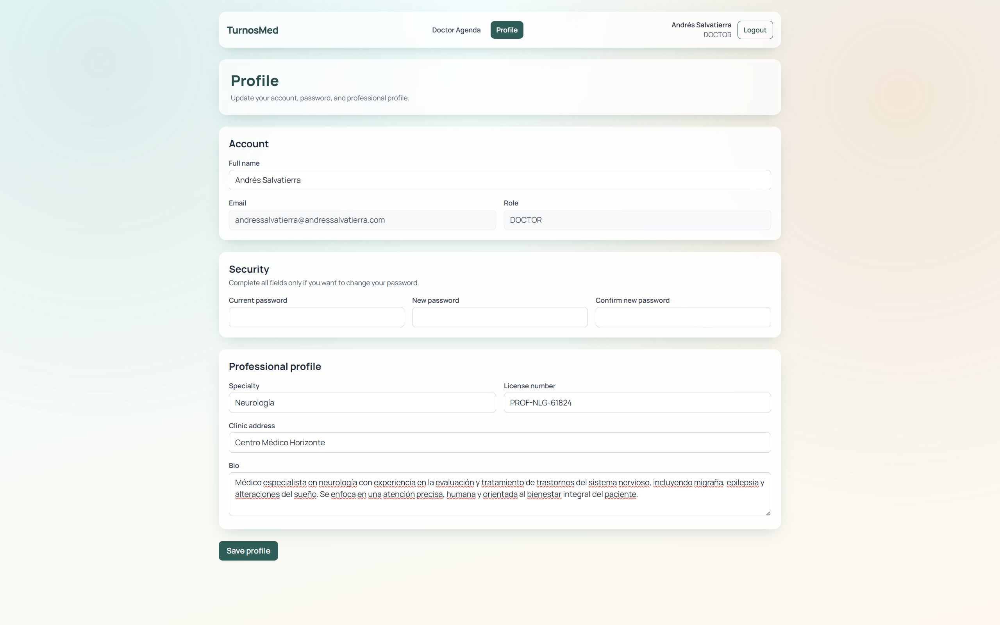
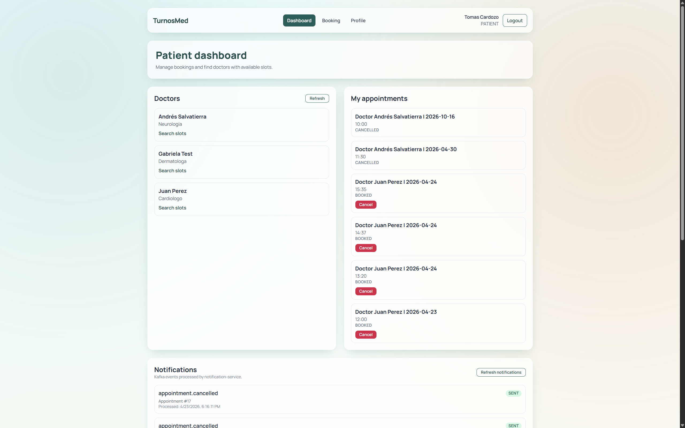
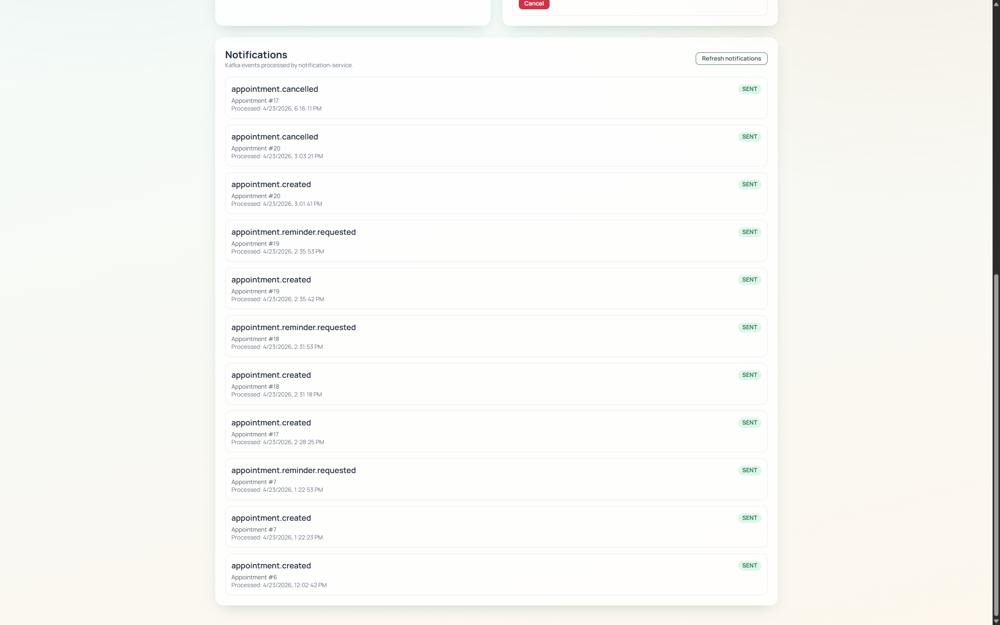
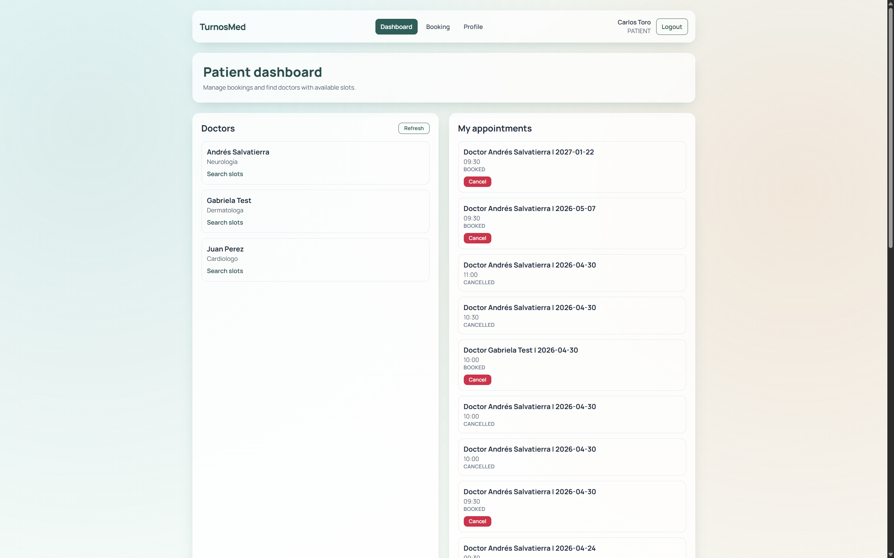
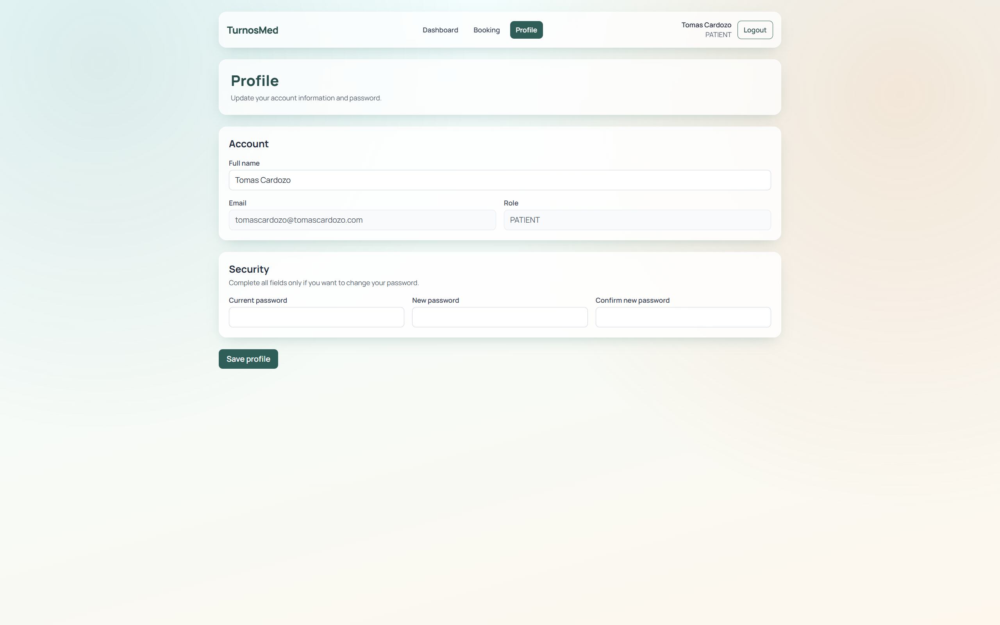
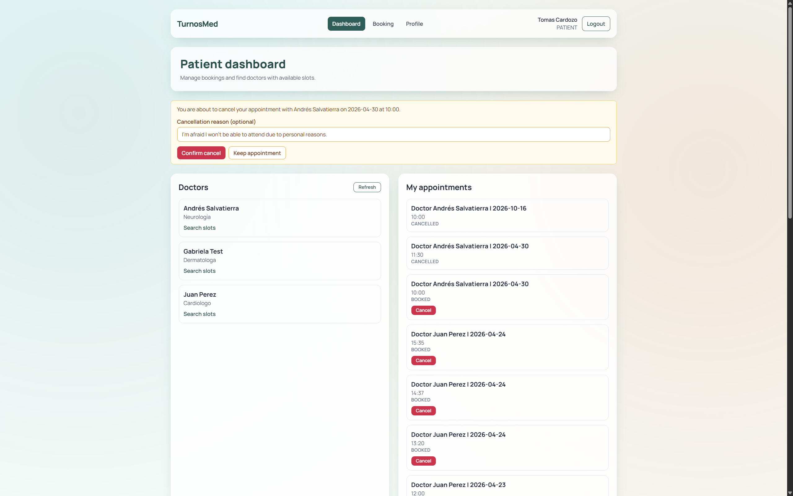
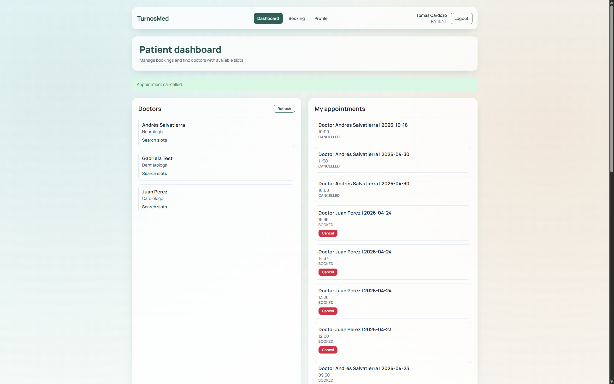

<p align="center">
  
</p>

<h1 align="center">🚀 Medical Appointment System</h1>

<p align="center">
  Microservices-based medical appointment platform built with Spring Boot, Kafka, JWT, API Gateway, Eureka, and React.
</p>


The project focuses on real backend engineering concerns: service boundaries, JWT security, synchronous + asynchronous communication, and reproducible local environments.

> 🚧 Current status: core flows are implemented. Advanced observability with Prometheus/Grafana is planned and documented, but not implemented yet.

---

## 📚 Table of Contents

- [🚀 Medical Appointment System](#-medical-appointment-system)
- [📝 System Description](#-system-description)
- [💻 Stack](#-stack)
- [🏗️ Architecture](#️-architecture)
- [🔌 Services and Ports](#-services-and-ports)
- [🚀 Quick Start (Public Demo)](#-quick-start-public-demo)
- [🌐 Local Demo URLs](#-local-demo-urls)
- [🧬 Development Mode](#-development-mode)
- [📦 GHCR Images](#-ghcr-images)
- [⚙️ CI/CD Workflows](#️-cicd-workflows)
- [📂 Project Structure](#-project-structure)
- [✨ Features](#-features)
- [📸 Screenshots](#-screenshots)
- [👤 Author](#-author)
- [📄 License](#-license)

---

## 📝 System Description

The platform supports two main user journeys:

- **Patient flow**: register, login, view doctors, search available slots, book/cancel appointments, review own appointments.
- **Doctor flow**: login, complete profile, define availability, review agenda.

It also includes asynchronous notifications for appointment lifecycle events.

---

## 💻 Stack

- **Backend**: Java 21, Spring Boot 3, Spring Cloud (Config Server, Eureka, Gateway), Spring Security + JWT, OpenFeign, Flyway, Maven
- **Data**: PostgreSQL (database-per-service)
- **Messaging**: Apache Kafka (KRaft)
- **Frontend**: React, Vite, Tailwind CSS, Axios, React Router
- **Infra/DevEx**: Docker, Docker Compose, GitHub Actions, GHCR

---

## 🏗️ Architecture

- `config-server`: centralized configuration from `infrastructure/config-repo`
- `discovery-server`: service registry/discovery (Eureka)
- `api-gateway`: single public entrypoint and route aggregation
- `auth-service`: registration, login, JWT, roles
- `doctor-service`: doctor profile + availability management
- `appointment-service`: booking/cancellation/rescheduling and scheduling rules
- `notification-service`: consumes Kafka events and sends notifications
- `frontend/web-app`: patient/doctor UI

---

## 🔌 Services and Ports

- `frontend-web-app`: `5173`
- `api-gateway`: `8080`
- `config-server`: `8888`
- `discovery-server`: `8761`
- `auth-service`: `8081`
- `doctor-service`: `8082`
- `appointment-service`: `8083`
- `notification-service`: `8084`
- `postgres`: `5432`
- `kafka` external: `9094`
- `mailhog` UI (optional profile): `8025`

---

## 🚀 Quick Start (Public Demo)

### 💻 Bash

#### 1) Clone

```bash
git clone https://github.com/TomasCardozo/medical-appointment-system.git
cd medical-appointment-system
```

#### 2) Run

```bash
./scripts/run.sh
```

###### What it does:

- Creates .env from .env.example if it does not exist
- Pulls Docker images from registry
- Starts all services using Docker Compose in detached mode

#### 3) Optional: include MailHog profile

> _Use this only if you want to test email notifications locally._

```bash
docker compose --profile mail up -d
```

### 🪟 PowerShell

#### 1) Clone

```powershell
git clone https://github.com/TomasCardozo/medical-appointment-system.git
cd medical-appointment-system
```

#### 2) Run

```powershell
.\scripts\run.ps1
```

###### What it does:

- Creates .env from .env.example if it does not exist
- Pulls Docker images from registry
- Starts all services using Docker Compose in detached mode

#### 3) Optional: include MailHog profile

> _Use this only if you want to test email notifications locally._

```powershell
docker compose --profile mail up -d
```

---

## 🌐 Local Demo URLs

- Frontend: `http://localhost:5173`
- Gateway health: `http://localhost:8080/actuator/health`
- Eureka UI: `http://localhost:8761`
- Config sample: `http://localhost:8888/application/docker`
- MailHog UI (optional): `http://localhost:8025`

---

## 🧬 Development Mode

For active development, use `deploy/compose.dev.yml` (builds from source using real project paths):

### 💻 Bash

```bash
docker compose -f deploy/compose.dev.yml up -d --build
```

Optional with MailHog:

```bash
docker compose -f deploy/compose.dev.yml --profile mail up -d --build
```

### 🪟 PowerShell

```powershell
docker compose -f deploy/compose.dev.yml up -d --build
```

Optional with MailHog:

```powershell
docker compose -f deploy/compose.dev.yml --profile mail up -d --build
```

---

## 📦 GHCR Images

Runtime compose consumes prebuilt public images from:

- `ghcr.io/tomascardozo/medical-appointment-system/config-server:latest`
- `ghcr.io/tomascardozo/medical-appointment-system/discovery-server:latest`
- `ghcr.io/tomascardozo/medical-appointment-system/api-gateway:latest`
- `ghcr.io/tomascardozo/medical-appointment-system/auth-service:latest`
- `ghcr.io/tomascardozo/medical-appointment-system/doctor-service:latest`
- `ghcr.io/tomascardozo/medical-appointment-system/appointment-service:latest`
- `ghcr.io/tomascardozo/medical-appointment-system/notification-service:latest`
- `ghcr.io/tomascardozo/medical-appointment-system/frontend-web-app:latest`

---

## ⚙️ CI/CD Workflows

- **CI**: `.github/workflows/ci.yml`
  - backend tests + package per service
  - frontend test + build
  - repository integrity checks
- **Image Publish**: `.github/workflows/publish-images.yml`
  - builds and pushes one image per service to GHCR
  - uses `GITHUB_TOKEN`
  - applies OCI metadata labels and tags

---

## 📂 Project Structure

```text
.
├── backend/
│   ├── discovery-server/
│   ├── config-server/
│   ├── api-gateway/
│   ├── auth-service/
│   ├── doctor-service/
│   ├── appointment-service/
│   └── notification-service/
├── frontend/
│   └── web-app/
├── infrastructure/
│   ├── config-repo/
│   ├── kafka/
│   ├── monitoring/
│   └── postgres/
├── deploy/
│   └── compose.dev.yml
├── docs/
├── scripts/
├── .github/workflows/
├── docker-compose.yml
├── .env.example
├── LICENSE
└── README.md
```

---

## ✨ Features

- JWT authentication and role-based access (`PATIENT`, `DOCTOR`, `ADMIN`)
- doctor profile and availability management
- slot search, booking, cancellation, rescheduling
- agenda views for doctor and patient
- Kafka events for appointment lifecycle:
  - `appointment.created`
  - `appointment.cancelled`
  - `appointment.rescheduled`
  - `appointment.reminder.requested`
- notification history endpoint and provider abstraction (`log`/`mail`)

---

## 📸 Screenshots

<p align="center">
  
  
</p>

<p align="center">
  
  
</p>

<p align="center">
  
  

</p>

<p align="center">
  
  
</p>

<p align="center">
  
  
</p>

---

## 👤 Author

**Tomas Gabriel Cardozo**  
Software Developer | Systems Engineering Student

- Portfolio: https://tomascardozo.dev/
- GitHub: https://github.com/TomasCardozo
- LinkedIn: https://www.linkedin.com/in/tomas-cardozo/

---

## 📄 License

MIT - see `LICENSE`.
